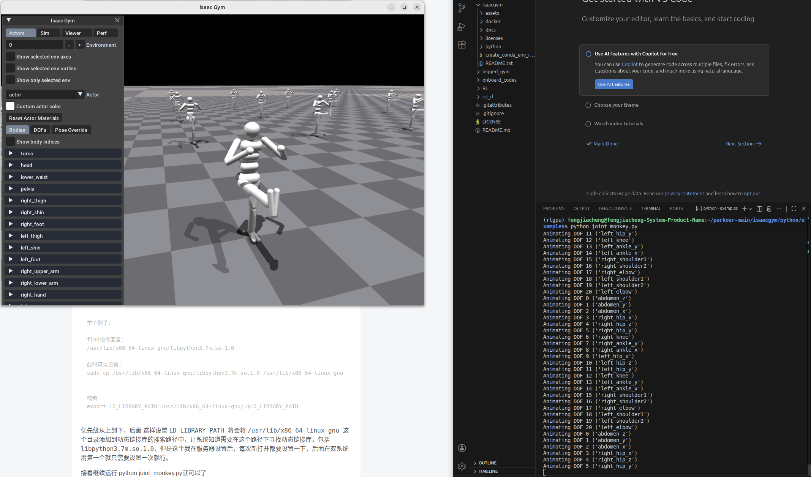
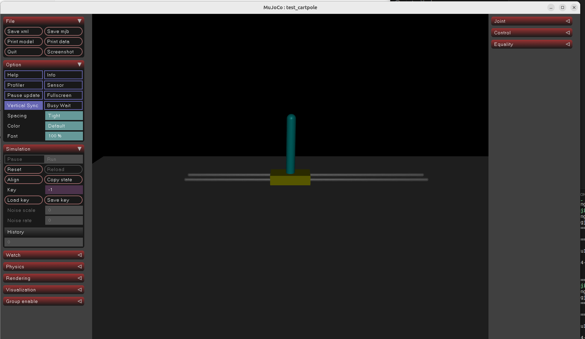
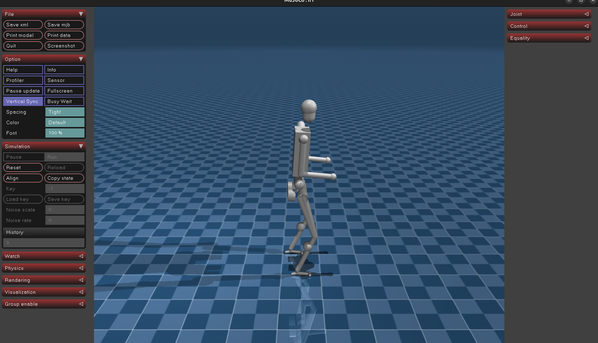

# Works for application
## I choose the Topic: <br>&ensp;*Rl for locomotion sim2realgap energy-efficient locomotion,hierarchical systems,and physically-consistent pipelines*
## My main references (reviews):<br>
**[1]**.W. Zhu, X. Guo, D. Owaki, K. Kutsuzawa and M. Hayashibe, <<A Survey of Sim-to-Real Transfer Techniques Applied to Reinforcement Learning for Bioinspired Robots,>> in IEEE Transactions on Neural Networks and Learning Systems, vol. 34, no. 7, pp. 3444-3459, July 2023, doi: 10.1109/TNNLS.2021.3112718.
https://ieeexplore.ieee.org/document/9552429

**My conclusions and understandings about it:**

**Solving the simulation-to-real problem needs a combination of methods.**

i.Better simulators.Build a suitable training environment for RL

&ensp;accurate robot parameters.
 
&ensp;trains use Domain Randomization for robustness

ii.Better Models 


&ensp;Models of Motor Primitives

&enspModels of State Transition

iii.Hierarchical Controllers and Distributed Controllers

iV.examples

**V.Conclusions, Outlook, and Limitations**

&ensp;Deploying Relay (RL) on complex robots is challenging; 
&ensp;the stability of RL needs improvement
&ensp;Better simulators are required to adapt RL for deployment on real robots.

**Following this paper,i found some related papers,However, the problem is that many related papers solving problems in this field do not contain any open-source code.**

**such as**

Pan, Jia-Hao, et al. "Deep reinforcement learning based optimization of microwave microfluidic sensor." IEEE Microwave and Wireless Technology Letters (2024).

Cao, Pan, et al. "Computational intelligence algorithms for UAV swarm networking and collaboration: A comprehensive survey and future directions." IEEE Communications Surveys & Tutorials 26.4 (2024): 2684-2728.

Liu, Lixing, et al. "A reinforcement learning path following strategy for snake robots based on transferable constrained-residual gait generator." IEEE Transactions on Industrial Electronics 71.12 (2024): 16013-16025.

Ye, Neng, et al. "Artificial intelligence for wireless physical-layer technologies (AI4PHY): A comprehensive survey." IEEE Transactions on Cognitive Communications and Networking 10.3 (2024): 729-755.

Qi, Ji, et al. "Reinforcement learning and sim-to-real transfer of reorientation and landing control for quadruped robots on asteroids." IEEE Transactions on Industrial Electronics 71.11 (2024): 14392-14400.

Zhang, Tianhao, et al. "Leveraging imitation learning on pose regulation problem of a robotic fish." IEEE Transactions on Neural Networks and Learning Systems 35.3 (2022): 4232-4245

Zhu, Wei, and Mitsuhiro Hayashibe. "Autonomous navigation system in pedestrian scenarios using a dreamer-based motion planner." IEEE Robotics and Automation Letters 8.6 (2023): 3836-3843.

Li, Zhiming, et al. "Learning-based data gathering for information freshness in UAV-assisted IoT networks." IEEE Internet of Things Journal 10.3 (2022): 2557-2573.

Zhu, Wei, and Mitsuhiro Hayashibe. "A hierarchical deep reinforcement learning framework with high efficiency and generalization for fast and safe navigation." IEEE Transactions on industrial Electronics 70.5 (2022): 4962-4971.

Dowdy, Jordan, and Jean Chagas Vaz. "Isaac Sim-to-Real: Reinforcement Learning based Locomotion for Quadrupeds." 2025 IEEE 21st International Conference on Automation Science and Engineering (CASE). IEEE, 2025.

Chaoxia, Chenyu, et al. "Sim-to-real transfer of automatic extinguishing strategy for firefighting robots." IEEE Robotics and Automation Letters (2024).

After a brief reading, I found that ***none of them had open-source code***.

Then I then found a website that allows me to better view the relevance of related papers, using graphs for easier reference: Connected Papers https://www.connectedpapers.com/


Then I found 3 papers，they have codes that looks like I can reproduce:

**[2]**.Cheng X, Shi K, Agarwal A, et al. Extreme parkour with legged robots[C]//2024 IEEE International Conference on Robotics and Automation (ICRA). IEEE, 2024: 11443-11450.

**[3]**.Zhuang Z, Fu Z, Wang J, et al. Robot parkour learning[J]. arXiv preprint arXiv:2309.05665, 2023.

**[4]**.Smith L, Kew J C, Li T, et al. Learning and adapting agile locomotion skills by transferring experience[J]. arXiv preprint arXiv:2304.09834, 2023.

To prevent the code from becoming outdated or incorrect, I selected 3, 2 of which can be used as an alternative.

firstly i choose Zhuang Z, Fu Z, Wang J, et al. Robot parkour learning[J]. arXiv preprint arXiv:2309.05665, 2023.

Its open-sourced code in https://github.com/ZiwenZhuang/parkour/tree/main

#### System and environment configuration before the experiment：

I installed the Ubuntu Linux system on my computer using a USB drive.

Install the latest version of Python.

```
sudo apt update && sudo apt upgrade -y
sudo apt install python3
```

Install isaacgym:

Unzip the compressed file isaacgym

```
mkdir -p ~/miniconda3
wget https://repo.anaconda.com/miniconda/Miniconda3-latest-Linux-x86_64.sh -O ~/miniconda3/miniconda.sh
bash ~/miniconda3/miniconda.sh -b -u -p ~/miniconda3
rm -rf ~/miniconda3/miniconda.sh
```
restart shell

```
~/miniconda3/bin/conda init bash
```

restart shell

```
~/miniconda3/bin/conda init zsh
```

```
cd /<my document...>/isaacgym/python/
bash ../create_conda_env_rlgpu.sh
```
run virtual environment

```
conda activate rlgpu
```

```
pip install -e .
```

Running Example

```
cd examples 
python joint_monkey.py
```



then run the code following the readme of Paper:
```
cd parkou-main/rsl_rl
pip install -e
```

```
cd ../legged_gym && pip install -e .
```
then when i run the train.py it went wrong

i meet some problems:The GPU model, Python version, and PyTorch version used by the author are inconsistent with mine, and I have struggled for a long time with attempts to resolve compatibility issues and switch versions.But failed

some bugs are like followings:

```
ImportError: /home/fengjiacheng/miniconda3/envs/rlgpu/lib/python3.7/site-packages/torch/lib/libtorch_cpu.so: undefined symbol: iJIT_NotifyEvent
```
 
i tried to update lib and Temporarily disable Intel JIT environment variables also make sure my CUDA and NIVIDA is correct
but still

```
undefined symbol: iJIT_NotifyEvent
```

then chage envirment paramaters

```
export LIB_PATH=$(find /lib /usr/lib -name "libstdc++.so.6" 2>/dev/null | head -1)
export LD_PRELOAD=$LIB_PATH
export DISABLE_JIT_PROFILING=1
export INTEL_JIT_DEBUG=0
```
also with some attempt to correct path

not work

then reinstall envirment totally

author said py 3.8 will work in pytorch 2.4.1 but actually it didnt work in my 5070ti,havnt figured out the reason.

```
ERROR: No matching distribution found for torch==2.4.1
WARNING: There was an error checking the latest version of pip.
```
**Then,more attempts with different pytorch version and py version,still not work:)**

Then i change it to another paper:Cheng X, Shi K, Agarwal A, et al. Extreme parkour with legged robots[C]//2024 IEEE International Conference on Robotics and Automation (ICRA). IEEE, 2024: 11443-11450.

following the explainations:https://github.com/chengxuxin/extreme-parkour

i rest the envirments,but still some problems with GPU,but **this time the python version and torch version that the author given is suitiable**,so this time i choose the cpu and declear the trainning times from 5000 to 300 to simply check the results.

in legged_robot_config.py
```
class runner
 policy_class_name = 'ActorCritic'
 algorithm_class_name = 'PPO'
 num_steps_per_env = 24 # per iteration
 max_iterations = 300 #number of policy updates #50000
 # logging
 save_interval = 10 # check for potential saves every this many iterations #100
```
#### Now just focus on 1 idea: 

#### If put the robot that trained in simulator in real world,with different envirments such as Friction,will the robot perferm different？bad or good？

after set a small size of trainning 300 times , the robot failed to pass

#### I want to compare the impact of different physical parameter constraints on the performance of the trained robot.

When attempting to increase the training quantity to 2000 for the second time, I found that using the CPU was too slow. Therefore, I tried the latest version adapted to my graphics card environment. I eventually discovered that I needed to update to the latest version of isaacgym. However, the author's code project had only been tested on an older version of isaacgym. To avoid spending a lot of time reconfiguring and then encountering bugs due to version upgrades, I decided to change the references and find another paper to reproduce the issue. (10/2 pm 2:44)

After meeting problems with finding some good papers with good opne-sourced codes,i change my mind,i begin to find some good open-sourced codes with good papers,then i used the Hugging Face with key words Rl sim2real control robot,then i found a good github project:https://github.com/rohanpsingh/LearningHumanoidWalking/  with this project,there is 3 papers presneted,all focued on the hunman robot rl control,i think this research is realy suitibale for my work,the followings:
Code for the papers:
- [**Robust Humanoid Walking on Compliant and Uneven Terrain with Deep Reinforcement Learning**](https://ieeexplore.ieee.org/abstract/document/10769793)
[Rohan P. Singh](https://rohanpsingh.github.io), [Mitsuharu Morisawa](https://unit.aist.go.jp/jrl-22022/en/members/member-morisawa.html), [Mehdi Benallegue](https://unit.aist.go.jp/jrl-22022/en/members/member-benalleguem.html), [Zhaoming Xie](https://zhaomingxie.github.io/), [Fumio Kanehiro](https://unit.aist.go.jp/jrl-22022/en/members/member-kanehiro.html)

- [**Learning Bipedal Walking for Humanoids with Current Feedback**](https://arxiv.org/pdf/2303.03724.pdf)
[Rohan P. Singh](https://rohanpsingh.github.io), [Zhaoming Xie](https://zhaomingxie.github.io/), [Pierre Gergondet](https://unit.aist.go.jp/jrl-22022/en/members/member-gergondet.html), [Fumio Kanehiro](https://unit.aist.go.jp/jrl-22022/en/members/member-kanehiro.html)

- [**Learning Bipedal Walking On Planned Footsteps For Humanoid Robots**](https://arxiv.org/pdf/2207.12644.pdf)
[Rohan P. Singh](https://rohanpsingh.github.io), [Mehdi Benallegue](https://unit.aist.go.jp/jrl-22022/en/members/member-benalleguem.html), [Mitsuharu Morisawa](https://unit.aist.go.jp/jrl-22022/en/members/member-morisawa.html), [Rafael Cisneros](https://unit.aist.go.jp/jrl-22022/en/members/member-cisneros.html), [Fumio Kanehiro](https://unit.aist.go.jp/jrl-22022/en/members/member-kanehiro.html)

And i choose the () one

with the uv package manager,it is more easy to biuld the environments,using the mujoco simulator.

simple example test with 500 iterations,swing the pole from hanging down to balancing upright.




then i train the **standing** model,it takes 3 hours using cpu(cant use gpu because of version conflict of torch and gpu):

results are like this:



When I ran the H1 task in the open-source code I pulled, it showed that there was no menagerie. After checking, I found that I needed to pull the mujoco library resources.

```
cd models
git clone https://github.com/google-deepmind/mujoco_menagerie.git
```

but problems with task jvcr_step

```
File "/home/fengjiacheng/1/LearningHumanoidWalking/rl/algos/ppo.py", line 312, in update_actor_critic
    clip_fraction = torch.mean((torch.abs(ratio - 1) > self.clip).float()).item()
KeyboardInterrupt
```

problems with task jvcr_walk

```
RuntimeError: expected m1 and m2 to have the same dtype, but got: float != double
```

So just try to do someting with H1 task(14/2 Pm)

**!! finally find the solution of the Bug，Start by modifying wrappers.py:**(15/2 Am.)

```
def mirror_clock_observation(self, obs):
        matrix = self.obs_mirror_matrix.to(device=obs.device, dtype=obs.dtype)
        # matrix = self.obs_mirror_matrix.to(obs.device)
```

```
def mirror_observation(self, obs):
        matrix = self.obs_mirror_matrix.to(device=obs.device, dtype=obs.dtype)
        # matrix = self.obs_mirror_matrix.to(obs.device)
```

```
def mirror_action(self, action):
        matrix = self.act_mirror_matrix.to(device=action.device, dtype=action.dtype)
        # matrix = self.act_mirror_matrix.to(action.device)
        return action @ matrix
```
